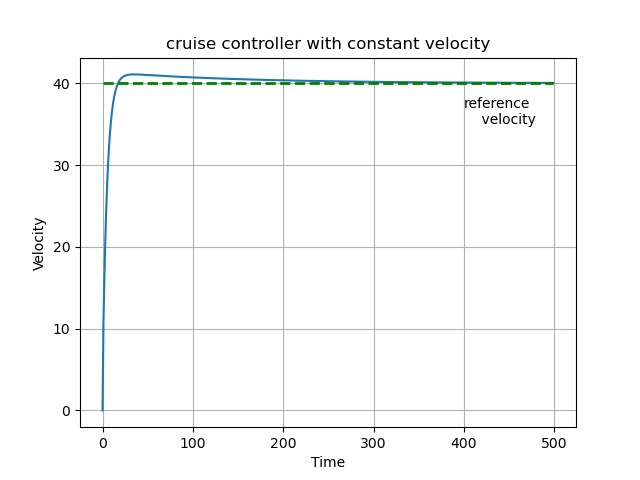
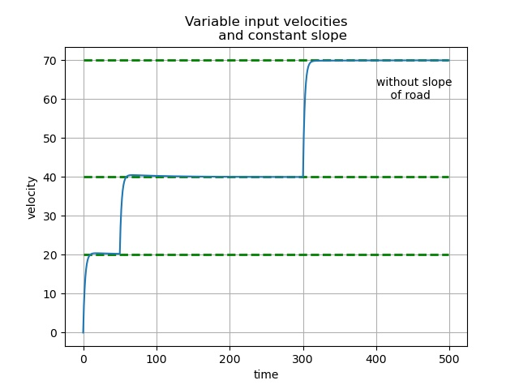
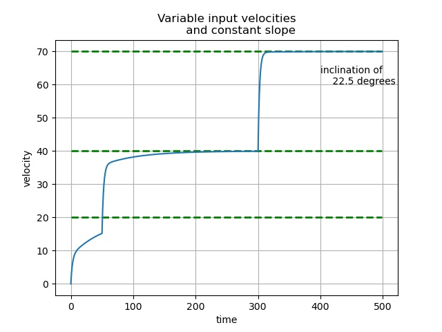
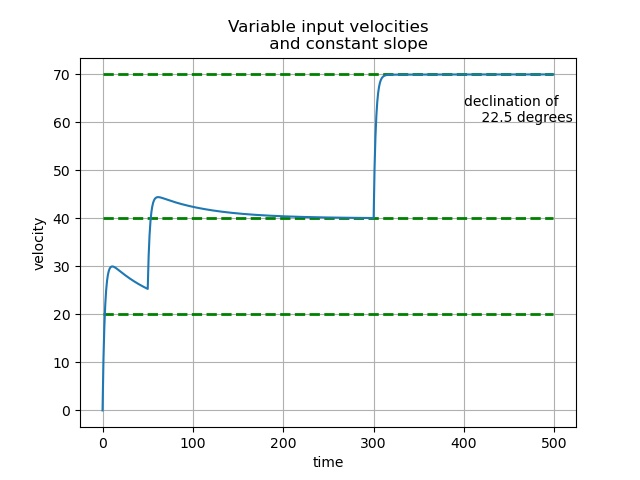

# **CRUISE_CONTROLLER**

## AIM:

Implementing the concept of PID controller by designing cruise controller to reach the desired velocity.  
1.With constant input velocity.  
2.With variable input velocity and constant slope.

## Motion Model:  
The model of the cruise control system is relatively simple. If the inertia of the wheels is neglected,  
And it is assumed that air drag (which is proportional to the car's speed at low speeds) is what is
Opposing the motion of the car, then the problem is reduced to a simple first-order system.  
Thus the motion of the car can be written as   
### mv_ + bv = u  
(where u is the input force provided by the engine to move the car at a certain velocity.)  
Constant parameters for the car i.e. mass and the drag coefficient are taken as m=1500 kg and 0.25 respectively.  

## Task 1:  
•	Find v and v_ from the dynamical model and compare it with the setpoint values.  
•	Find the error and use the PID controller with the appropriate tuning parameter to tune the controller to an acceptable level of accuracy.  
•	The tuning parameters you choose to give the system a rise time of about 10secs and a maximum overshoot of less than 5%.(rise time is the time taken to reach 90% of the steady-state value)  
### Results:  
 | reference velocity = 40 m/s   with overshoot of 2.7% 
-------------------------------------------------- |-----------------------

## Task 2:  
• Update code to handle setpoint changes varying with the time of the simulation.  
• Change the dynamical model of the car to handle rolling friction(u = 0.01) as well.  
• Design the controller to handle a constant slope of the road. (positive or negative)  
### Results:  
without slope  | positive slope 
--------------------------------------------------------|-----------------------
negative slope   | input velocities were   v = 20 m/s  0 <t < 50   v = 40 m/s  50 <t < 300   v = 70 m/s  t > 300

